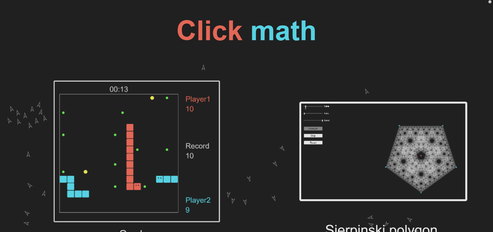

# js-ui_on_canvas_example
Here I include an example on how to use the super simple libraries I built using <a href="https://p5js.org/">p5.js</a>. I also use this as default proyect.
## URL
This proyect is hosted by github pages at <a href="https://pabloqb2000.github.io/js-ui_on_canvas_example/">this link</a>.
# Libraries
Here I include a little example on how the libraries I built work
# UI
### Contents of the UI
  - Slider
  - Button
  - ToggleButton
  - Color picker
  - Options box
### Description of the elements
#### All elements
All elements are highlightable and hideable  
The UI can auto distribute the elements in a table form.  
Most elements can perform an action when their state changes
#### Slider
Normal slider for choosing a value between to given numbers 
It can show a label, show the actual value and have a discrete step size 
The value can be changed by dragging the slider or using the mouse wheel over the slider
#### Button
Performs a given action when clicked
#### ToggleButton
Button wich can be activated / deactivated
#### ColorPicker
One button wich pops up a color picker window
#### Options box
Box wich when clicked displays a list of options that can be selected
# Draggable
### Draggable elements
This elements can be dragged arround the canvas  
Then can as well perform an action when dragged  
The posible shapes of the elements are:  
  - Circle
  - Rectagle
# Math
### Matrix
This is a class to perform different kinds of matrixs arithmetics.
You can build a matrix in different ways and then perform some operations like:
  - Addition
  - Substraction
  - Multiplication (by another matrix or by a scalar)
  - Inverse
  - Solve as a set of linear ecuations
  - Echelonize
  - Determinant
  - ...
 ### Vector
 This class perform different kinds of vector arithmetics.  
 You can build a vector and then compute different operetaions like:
  - Add vector / scalar
  - Substract vector / scalar
  - Dot product
  - Multiplication / division by scalar
  - l-Norm
  - l-Norm normalization
  - Scale to fit norm
  - ...
#### For 2D vectors you can also:
  - Rotate
  - Get rotation
  - Create them randomly
  - Create them in polar coordinates
  - ...
## Screenshot
</img>
## References
To find more information about the <b>awesome</b> library used for this proyect visit:
<a href="https://p5js.org/"> https://p5js.org/ </a>
